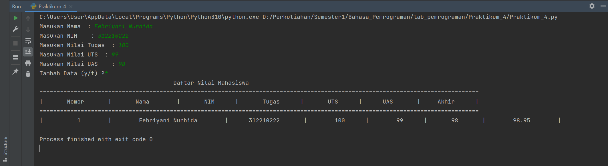

Febriyani Nuthida (312210222)

TI.22.A.2

# PRAKTIKUM 4
Program Sederhana Python Penambahan Data Ke Dalam List 
List (Daftar) adalah salah satu datatype yang paling sering digunakan dan sangat serbaguna yang digunakan dengan Python. • Pada pemrograman Python, List dibuat dengan menempatkan semua item (elemen) di dalam kurung siku [], dipisahkan dengan tanda koma. 

## Latihan 1

Buat sebuah list sebanyak 5 elemen dengan nilai bebas.
membuat list
```python
a=[] 
```
berikut program yang saya buat:

### Akses list
kodenya :
```python
KoreanFood=["ramyeon", "gimbab", "kimchi", "tteokbokki", "bulgogi"]
```
- kemudian untuk menampilkan elemen ke 3 dalam list gunakan kode berikut :

```python
print("Tampilkan menu ke 3:", KoreanFood[2])
```
- nah, untuk perintah mengambil elemen ke 2 sampai ke elemen ke 4 gunakan kode berikut :

```python
print("ambil menu ke 2 sampai 4:", KoreanFood[1:4])
```
- lalu untuk perintah mengambil elemen terakhir bisa menggunakan kode berikut :

```python
print("ambil menu terakhir:", KoreanFood[5-1])
```

### ubah elemen list
- untuk merubah elemen ke empat dengan nilai lain gunakan kode berikut :
```python
KoreanFood[3] = "Kue Beras Pedas"
```
- lalu tampilkan keterangan perubahannya dengan kode :

```python
print("merubah menu ke 4 dengan nilai lain:", KoreanFood)
```
- untuk merubah elemen ke 4 sampai terakhir gunakan kode berikut :

```python
KoreanFood[3:] = "Kue Beras Pedas", "Daging BBQ" 
```
- lalu untuk memunculkannya gunakan kode berikut :

```python
print("merubah menu ke 4 sampai menu terakhir:", KoreanFood)
```

### tambah elemen list

buat 2 list terlebih dahulu
```python
Ganjil=[1,3,5,7,9]
Genap=[2,4,6,8,10]
```
- untuk menambahkan list Ganjil Ke dalam list Genap gubakan perintah berikut :
```python
Genap.append(Ganjil[1:3])
print("2 bagian List Ganjil dijadikan List Genap:", Genap)
```
- untuk menambahkan list Genap dengan String gunakan perintah berikut :
```python
Genap.append("Habis Dibagi 2")
print("Tambah Genap dengan Sring:", Genap)
```
- untuk menambahkan list Genap dengan 3 nilai gunakan perintah berikut :

```python
print("Tambah list Genap dengan 3 nilai:", Genap+[11,12,13])
```
- untuk menggabungkan list Genap dan list Ganjil menjadi list angka gunakan perintah berikut :
```python
Angka=Genap+Ganjil
print("Gabungan list Genap dan Ganjil:", Angka)
```

Berikut hasil programnya:


# Tugas Praktikum 

## Membuat program sederhana untuk menambahkan data kedalam sebuah list 

- berikut saya tampilkan flowchart menambah data ke sebuah list :


- berikut gambar pemrograman yang telah saya buat:


- untuk mendefinisikan index gunakan kode berikut:
```python
i=0
```
- untuk membuat list berupa nama, NIM, Tugas, UTS, dan UAS gunakan kode berikut :

```python
Nama=[]
NIM=[]
Tugas=[]
UTS=[]
UAS=[]
NilaiAkhir=[]
```
- Untuk menginput nilai ke dalam list yang telah dibuat, gunakan append dan perulangan berupa while seperti contoh di bwawah:

```python
while True:
    s_Nama=input("Masukan Nama  : ")
    Nama.append(s_Nama)
    s_NIM=input("Masukan NIM    : ")
    NIM.append(s_NIM)
    i_Tugas=input("Masukan Nilai Tugas  : ")
    Tugas.append(i_Tugas)
    i_UTS=input("Masukan Nilai UTS  : ")
    UTS.append(i_UTS)
    i_UAS=input("Masukan Nilai UAS    : ")
    UAS.append(i_UAS)
```
- untuk mengitung nilai akhir atau rata-rata, maka gunakan perhitungan dan kode berikut :

```python
i_NilaiAkhir=(int(i_Tugas)*0.30)+(int(i_UTS)*0.35)+(int(i_UAS)*0.35)
    NilaiAkhir.append(i_NilaiAkhir)
```
- untuk menampilkan pertanyaan menambah data atau tidak gunakan kode berikut :

```python
more=""
    while more!="y" and more!="t":
        more=input("Tambah Data (y/t) ?")
    i+=1
    if more=="t":
        break
```
- nah, agar output data tampak seperti tabel gunakan kode berikut :

```python
print("                                       Daftar Nilai Mahasiswa                                                                   ")
print("================================================================================================================================")
print("|       Nomor       |       Nama        |       NIM      |       Tugas      |       UTS      |      UAS       |     Akhir      |")
print("================================================================================================================================")
for n in range(i):
    print("|         ",n+1,"       |       ",Nama[n],"       |     ",NIM[n],"      |       ",Tugas[n],"     |       ",UTS[n],"     |      ",UAS[n],"      |       ",NilaiAkhir[n],"       |")
```
- untuk menampilkan hasil data yang telah diinput dan dihitung rata-ratanya bida gunakan perintah for n in range seperti program di atas.
- berikut saya tampilkan hasil dari program menginput nilai mahasiswa


## Sekiian dan terima kasih (gomawo :)